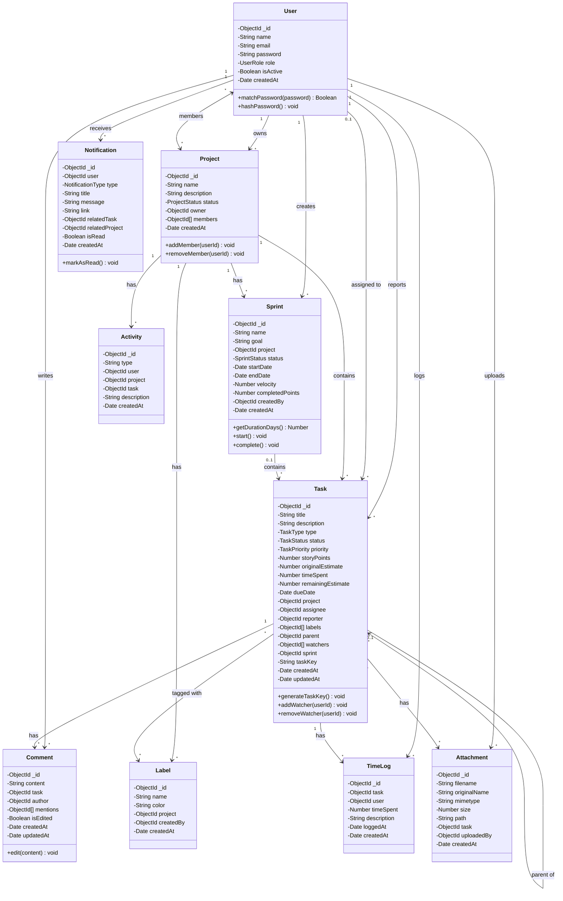
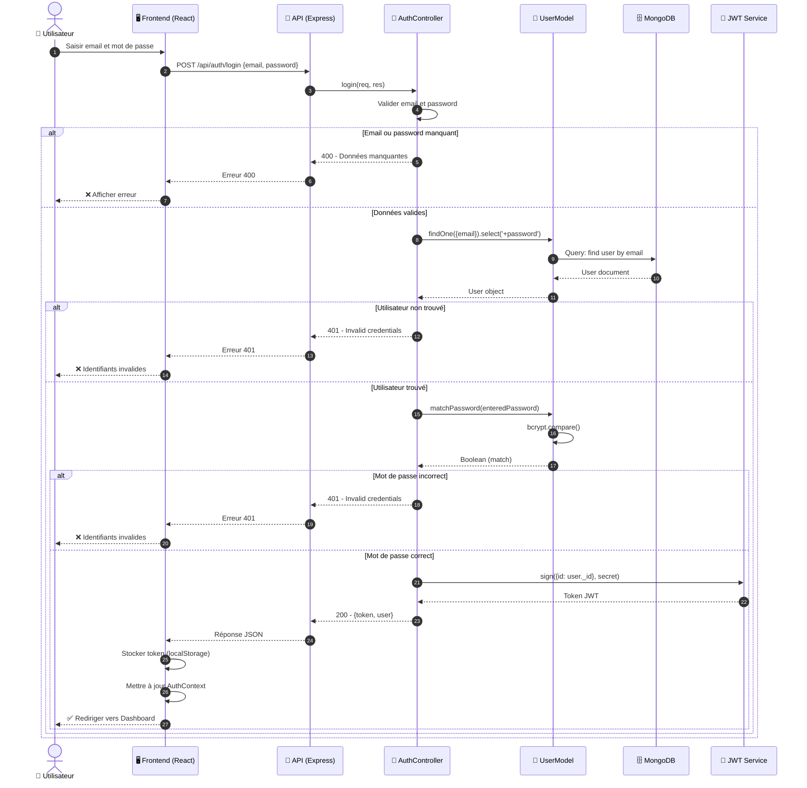
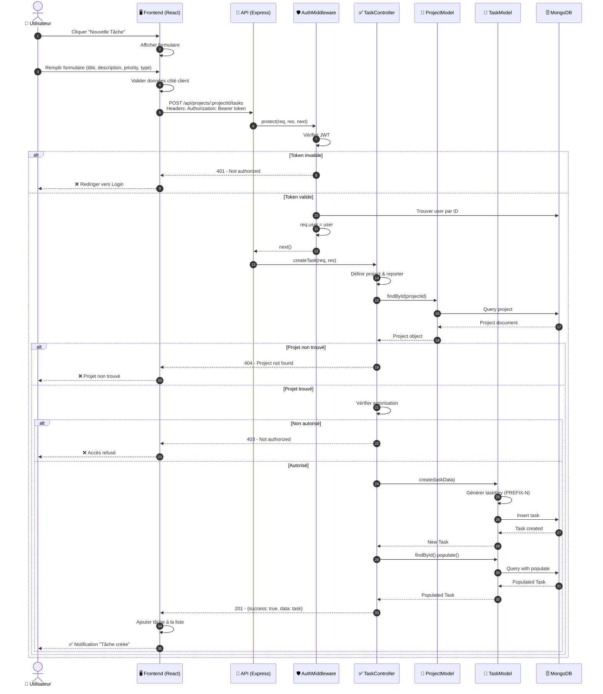
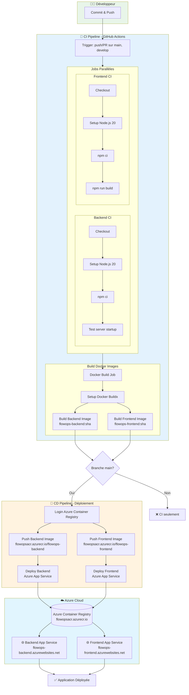
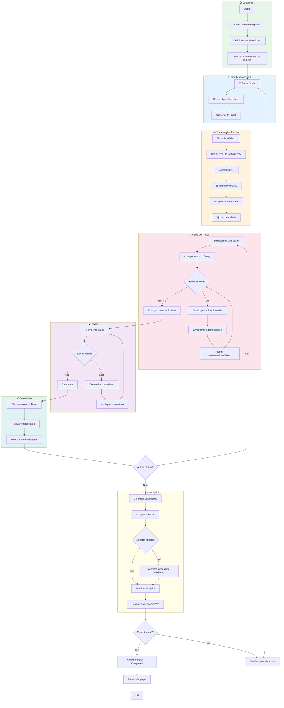
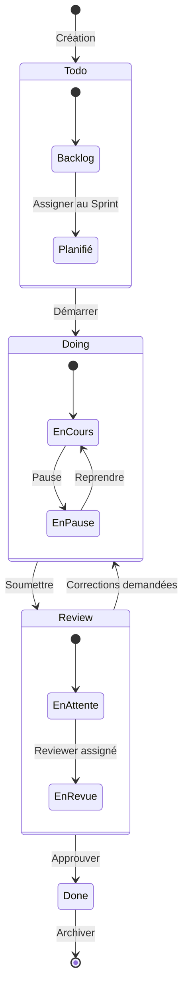

# Diagrammes UML - FlowOps

Ce document contient tous les diagrammes UML du projet FlowOps, une application de gestion de projets Agile.

---

## 1. Diagramme de Cas d'Utilisation

```mermaid
flowchart TB
    subgraph Acteurs
        V[👤 Visiteur]
        M[👥 Membre]
        PM[👨‍💼 Chef de Projet]
        A[🔧 Administrateur]
    end
    
    V --> M
    M --> PM
    PM --> A
    
    subgraph FlowOps["🚀 FlowOps - Système de Gestion de Projets Agile"]
        subgraph Auth["🔐 Authentification"]
            UC1((S'inscrire))
            UC2((Se connecter))
            UC3((Se déconnecter))
            UC4((Consulter profil))
        end
        
        subgraph Projects["📁 Gestion des Projets"]
            UC5((Créer projet))
            UC6((Consulter projets))
            UC7((Modifier projet))
            UC8((Supprimer projet))
            UC9((Ajouter membres))
        end
        
        subgraph Tasks["✅ Gestion des Tâches"]
            UC10((Créer tâche))
            UC11((Consulter tâches))
            UC12((Modifier tâche))
            UC13((Supprimer tâche))
            UC14((Assigner tâche))
            UC15((Changer statut))
            UC16((Ajouter labels))
            UC17((Suivre tâche))
        end
        
        subgraph Sprints["🏃 Gestion des Sprints"]
            UC18((Créer sprint))
            UC19((Démarrer sprint))
            UC20((Terminer sprint))
            UC21((Consulter backlog))
        end
        
        subgraph Collab["💬 Collaboration"]
            UC22((Ajouter commentaire))
            UC23((Consulter notifications))
            UC24((Joindre fichiers))
            UC25((Enregistrer temps))
        end
        
        subgraph Admin["⚙️ Administration"]
            UC26((Gérer utilisateurs))
            UC27((Consulter statistiques))
        end
    end
    
    V -.-> UC1
    V -.-> UC2
    
    M -.-> UC3
    M -.-> UC4
    M -.-> UC6
    M -.-> UC10
    M -.-> UC11
    M -.-> UC12
    M -.-> UC15
    M -.-> UC17
    M -.-> UC21
    M -.-> UC22
    M -.-> UC23
    M -.-> UC24
    M -.-> UC25
    
    PM -.-> UC5
    PM -.-> UC7
    PM -.-> UC9
    PM -.-> UC13
    PM -.-> UC14
    PM -.-> UC16
    PM -.-> UC18
    PM -.-> UC19
    PM -.-> UC20
    PM -.-> UC27
    
    A -.-> UC8
    A -.-> UC26
```

### Description des Acteurs

| Acteur | Rôle | Permissions |
|--------|------|-------------|
| **Visiteur** | Utilisateur non authentifié | Inscription, Connexion |
| **Membre** | Utilisateur authentifié de base | Consulter projets/tâches, Créer/modifier tâches, Commenter |
| **Chef de Projet** | Gestionnaire de projet | Créer projets, Gérer sprints, Assigner tâches, Voir statistiques |
| **Administrateur** | Super utilisateur | Supprimer projets, Gérer tous les utilisateurs |

---

## 2. Diagramme de Classes

### Énumérations

| Enum | Valeurs |
|------|---------|
| **UserRole** | `admin`, `project_manager`, `member` |
| **ProjectStatus** | `planned`, `in_progress`, `completed` |
| **TaskType** | `task`, `bug`, `story`, `epic`, `subtask` |
| **TaskStatus** | `todo`, `doing`, `review`, `done` |
| **TaskPriority** | `lowest`, `low`, `medium`, `high`, `highest` |
| **SprintStatus** | `planned`, `active`, `completed` |
| **NotificationType** | `task_assigned`, `task_commented`, `task_mentioned`, `task_status_changed`, `sprint_started`, `sprint_completed`, `task_due_soon` |

---

## 3. Diagramme de Séquence - Authentification (Login)

---

## 4. Diagramme de Séquence - Création de Tâche

---

## 5. Diagramme Pipeline CI/CD

### Détails de la Configuration CI/CD

| Composant | Description |
|-----------|-------------|
| **Trigger CI** | Push ou PR sur `main` ou `develop` |
| **Trigger CD** | Push sur `main` uniquement |
| **Node Version** | 20 |
| **Registry** | Azure Container Registry (flowopsacr.azurecr.io) |
| **Backend URL** | https://flowops-backend.azurewebsites.net |
| **Frontend URL** | https://flowops-frontend.azurewebsites.net |

### Secrets Utilisés

- `ACR_USERNAME` - Username Azure Container Registry
- `ACR_PASSWORD` - Password Azure Container Registry
- `AZURE_BACKEND_PUBLISH_PROFILE` - Profil de publication Backend
- `AZURE_FRONTEND_PUBLISH_PROFILE` - Profil de publication Frontend

---

## 6. Diagramme d'Activité - Workflow Complet d'un Projet

### États des Tâches (Workflow Kanban)

---

## Résumé de l'Architecture FlowOps

| Couche | Technologies | Description |
|--------|--------------|-------------|
| **Frontend** | React, Vite | Interface utilisateur SPA |
| **Backend** | Node.js, Express | API REST |
| **Base de données** | MongoDB | Stockage NoSQL |
| **Authentification** | JWT, bcrypt | Tokens, hashage passwords |
| **CI/CD** | GitHub Actions | Automatisation build/deploy |
| **Cloud** | Azure App Service, ACR | Hébergement containers |

---

*Généré pour le projet FlowOps - Gestion de Projets Agile*
