# Diagrammes UML - FlowOps

Ce document contient tous les diagrammes UML du projet FlowOps, une application de gestion de projets Agile.

---

## 1. Diagramme de Cas d'Utilisation

```mermaid
flowchart TB
    subgraph Acteurs
        V[👤 Visiteur]
        M[👥 Membre]
        PM[👨‍💼 Chef de Projet]
        A[🔧 Administrateur]
    end
    
    V --> M
    M --> PM
    PM --> A
    
    subgraph FlowOps["🚀 FlowOps - Système de Gestion de Projets Agile"]
        subgraph Auth["🔐 Authentification"]
            UC1((S'inscrire))
            UC2((Se connecter))
            UC3((Se déconnecter))
            UC4((Consulter profil))
        end
        
        subgraph Projects["📁 Gestion des Projets"]
            UC5((Créer projet))
            UC6((Consulter projets))
            UC7((Modifier projet))
            UC8((Supprimer projet))
            UC9((Ajouter membres))
        end
        
        subgraph Tasks["✅ Gestion des Tâches"]
            UC10((Créer tâche))
            UC11((Consulter tâches))
            UC12((Modifier tâche))
            UC13((Supprimer tâche))
            UC14((Assigner tâche))
            UC15((Changer statut))
            UC16((Ajouter labels))
            UC17((Suivre tâche))
        end
        
        subgraph Sprints["🏃 Gestion des Sprints"]
            UC18((Créer sprint))
            UC19((Démarrer sprint))
            UC20((Terminer sprint))
            UC21((Consulter backlog))
        end
        
        subgraph Collab["💬 Collaboration"]
            UC22((Ajouter commentaire))
            UC23((Consulter notifications))
            UC24((Joindre fichiers))
            UC25((Enregistrer temps))
        end
        
        subgraph Admin["⚙️ Administration"]
            UC26((Gérer utilisateurs))
            UC27((Consulter statistiques))
        end
    end
    
    V -.-> UC1
    V -.-> UC2
    
    M -.-> UC3
    M -.-> UC4
    M -.-> UC6
    M -.-> UC10
    M -.-> UC11
    M -.-> UC12
    M -.-> UC15
    M -.-> UC17
    M -.-> UC21
    M -.-> UC22
    M -.-> UC23
    M -.-> UC24
    M -.-> UC25
    
    PM -.-> UC5
    PM -.-> UC7
    PM -.-> UC9
    PM -.-> UC13
    PM -.-> UC14
    PM -.-> UC16
    PM -.-> UC18
    PM -.-> UC19
    PM -.-> UC20
    PM -.-> UC27
    
    A -.-> UC8
    A -.-> UC26
```

### Description des Acteurs

| Acteur | Rôle | Permissions |
|--------|------|-------------|
| **Visiteur** | Utilisateur non authentifié | Inscription, Connexion |
| **Membre** | Utilisateur authentifié de base | Consulter projets/tâches, Créer/modifier tâches, Commenter |
| **Chef de Projet** | Gestionnaire de projet | Créer projets, Gérer sprints, Assigner tâches, Voir statistiques |
| **Administrateur** | Super utilisateur | Supprimer projets, Gérer tous les utilisateurs |

---

## 2. Diagramme de Classes

### Énumérations

| Enum | Valeurs |
|------|---------|
| **UserRole** | `admin`, `project_manager`, `member` |
| **ProjectStatus** | `planned`, `in_progress`, `completed` |
| **TaskType** | `task`, `bug`, `story`, `epic`, `subtask` |
| **TaskStatus** | `todo`, `doing`, `review`, `done` |
| **TaskPriority** | `lowest`, `low`, `medium`, `high`, `highest` |
| **SprintStatus** | `planned`, `active`, `completed` |
| **NotificationType** | `task_assigned`, `task_commented`, `task_mentioned`, `task_status_changed`, `sprint_started`, `sprint_completed`, `task_due_soon` |

---

## 3. Diagramme de Séquence - Authentification (Login)

```mermaid
sequenceDiagram
    autonumber
    actor User as 👤 Utilisateur
    participant Frontend as 🖥️ Frontend (React)
    participant API as 🔌 API (Express)
    participant AuthCtrl as 🔐 AuthController
    participant UserModel as 👥 UserModel
    participant DB as 🗄️ MongoDB
    participant JWT as 🔑 JWT Service

    User->>Frontend: Saisir email et mot de passe
    Frontend->>API: POST /api/auth/login {email, password}
    API->>AuthCtrl: login(req, res)
    
    AuthCtrl->>AuthCtrl: Valider email et password
    
    alt Email ou password manquant
        AuthCtrl-->>API: 400 - Données manquantes
        API-->>Frontend: Erreur 400
        Frontend-->>User: ❌ Afficher erreur
    else Données valides
        AuthCtrl->>UserModel: findOne({email}).select('+password')
        UserModel->>DB: Query: find user by email
        DB-->>UserModel: User document
        UserModel-->>AuthCtrl: User object
        
        alt Utilisateur non trouvé
            AuthCtrl-->>API: 401 - Invalid credentials
            API-->>Frontend: Erreur 401
            Frontend-->>User: ❌ Identifiants invalides
        else Utilisateur trouvé
            AuthCtrl->>UserModel: matchPassword(enteredPassword)
            UserModel->>UserModel: bcrypt.compare()
            UserModel-->>AuthCtrl: Boolean (match)
            
            alt Mot de passe incorrect
                AuthCtrl-->>API: 401 - Invalid credentials
                API-->>Frontend: Erreur 401
                Frontend-->>User: ❌ Identifiants invalides
            else Mot de passe correct
                AuthCtrl->>JWT: sign({id: user._id}, secret)
                JWT-->>AuthCtrl: Token JWT
                AuthCtrl-->>API: 200 - {token, user}
                API-->>Frontend: Réponse JSON
                Frontend->>Frontend: Stocker token (localStorage)
                Frontend->>Frontend: Mettre à jour AuthContext
                Frontend-->>User: ✅ Rediriger vers Dashboard
            end
        end
    end
```

---

## 4. Diagramme de Séquence - Création de Tâche

```mermaid
sequenceDiagram
    autonumber
    actor User as 👤 Utilisateur
    participant Frontend as 🖥️ Frontend (React)
    participant API as 🔌 API (Express)
    participant Auth as 🛡️ AuthMiddleware
    participant TaskCtrl as ✅ TaskController
    participant ProjectModel as 📁 ProjectModel
    participant TaskModel as 📝 TaskModel
    participant DB as 🗄️ MongoDB

    User->>Frontend: Cliquer "Nouvelle Tâche"
    Frontend->>Frontend: Afficher formulaire
    User->>Frontend: Remplir formulaire (title, description, priority, type)
    Frontend->>Frontend: Valider données côté client
    
    Frontend->>API: POST /api/projects/:projectId/tasks<br/>Headers: Authorization: Bearer token
    API->>Auth: protect(req, res, next)
    Auth->>Auth: Vérifier JWT
    
    alt Token invalide
        Auth-->>Frontend: 401 - Not authorized
        Frontend-->>User: ❌ Rediriger vers Login
    else Token valide
        Auth->>DB: Trouver user par ID
        Auth->>Auth: req.user = user
        Auth-->>API: next()
        
        API->>TaskCtrl: createTask(req, res)
        TaskCtrl->>TaskCtrl: Définir project & reporter
        TaskCtrl->>ProjectModel: findById(projectId)
        ProjectModel->>DB: Query project
        DB-->>ProjectModel: Project document
        ProjectModel-->>TaskCtrl: Project object
        
        alt Projet non trouvé
            TaskCtrl-->>Frontend: 404 - Project not found
            Frontend-->>User: ❌ Projet non trouvé
        else Projet trouvé
            TaskCtrl->>TaskCtrl: Vérifier autorisation
            
            alt Non autorisé
                TaskCtrl-->>Frontend: 403 - Not authorized
                Frontend-->>User: ❌ Accès refusé
            else Autorisé
                TaskCtrl->>TaskModel: create(taskData)
                TaskModel->>TaskModel: Générer taskKey (PREFIX-N)
                TaskModel->>DB: Insert task
                DB-->>TaskModel: Task created
                TaskModel-->>TaskCtrl: New Task
                
                TaskCtrl->>TaskModel: findById().populate()
                TaskModel->>DB: Query with populate
                DB-->>TaskModel: Populated Task
                TaskModel-->>TaskCtrl: Populated Task
                
                TaskCtrl-->>Frontend: 201 - {success: true, data: task}
                Frontend->>Frontend: Ajouter tâche à la liste
                Frontend-->>User: ✅ Notification "Tâche créée"
            end
        end
    end
```

---

## 5. Diagramme Pipeline CI/CD

```mermaid
flowchart TB
    subgraph DEV["👨‍💻 Développeur"]
        A[Commit & Push]
    end
    
    A --> B
    
    subgraph CI["🔄 CI Pipeline - GitHub Actions"]
        B[Trigger: push/PR sur main, develop]
        
        subgraph PARALLEL["Jobs Parallèles"]
            direction LR
            subgraph BACKEND["Backend CI"]
                C1[Checkout]
                C2[Setup Node.js 20]
                C3[npm ci]
                C4[Test server startup]
                C1 --> C2 --> C3 --> C4
            end
            
            subgraph FRONTEND["Frontend CI"]
                D1[Checkout]
                D2[Setup Node.js 20]
                D3[npm ci]
                D4[npm run build]
                D1 --> D2 --> D3 --> D4
            end
        end
        
        B --> PARALLEL
        
        PARALLEL --> E[Docker Build Job]
        
        subgraph DOCKER["Build Docker Images"]
            E --> F1[Setup Docker Buildx]
            F1 --> G1[Build Backend Image<br/>flowops-backend:sha]
            F1 --> G2[Build Frontend Image<br/>flowops-frontend:sha]
        end
    end
    
    G1 --> H{Branche main?}
    G2 --> H
    
    H -->|Non| I[❌ CI seulement]
    H -->|Oui| J
    
    subgraph CD["🚀 CD Pipeline - Déploiement"]
        J[Login Azure Container Registry]
        J --> K1[Push Backend Image<br/>flowopsacr.azurecr.io/flowops-backend]
        J --> K2[Push Frontend Image<br/>flowopsacr.azurecr.io/flowops-frontend]
        
        K1 --> L1[Deploy Backend<br/>Azure App Service]
        K2 --> L2[Deploy Frontend<br/>Azure App Service]
    end
    
    subgraph AZURE["☁️ Azure Cloud"]
        M[(Azure Container Registry<br/>flowopsacr.azurecr.io)]
        N1[🌐 Backend App Service<br/>flowops-backend.azurewebsites.net]
        N2[🌐 Frontend App Service<br/>flowops-frontend.azurewebsites.net]
    end
    
    L1 --> M
    L2 --> M
    M --> N1
    M --> N2
    
    N1 --> O[✅ Application Déployée]
    N2 --> O
    
    style CI fill:#e3f2fd
    style CD fill:#fff3e0
    style AZURE fill:#e1f5fe
    style DEV fill:#e8f5e9
```

### Détails de la Configuration CI/CD

| Composant | Description |
|-----------|-------------|
| **Trigger CI** | Push ou PR sur `main` ou `develop` |
| **Trigger CD** | Push sur `main` uniquement |
| **Node Version** | 20 |
| **Registry** | Azure Container Registry (flowopsacr.azurecr.io) |
| **Backend URL** | https://flowops-backend.azurewebsites.net |
| **Frontend URL** | https://flowops-frontend.azurewebsites.net |

### Secrets Utilisés

- `ACR_USERNAME` - Username Azure Container Registry
- `ACR_PASSWORD` - Password Azure Container Registry
- `AZURE_BACKEND_PUBLISH_PROFILE` - Profil de publication Backend
- `AZURE_FRONTEND_PUBLISH_PROFILE` - Profil de publication Frontend

---

## 6. Diagramme d'Activité - Workflow Complet d'un Projet

### États des Tâches (Workflow Kanban)

```mermaid
stateDiagram-v2
    [*] --> Todo: Création
    Todo --> Doing: Démarrer
    Doing --> Review: Soumettre
    Review --> Doing: Corrections demandées
    Review --> Done: Approuver
    Done --> [*]: Archiver
    
    state Todo {
        [*] --> Backlog
        Backlog --> Planifié: Assigner au Sprint
    }
    
    state Doing {
        [*] --> EnCours
        EnCours --> EnPause: Pause
        EnPause --> EnCours: Reprendre
    }
    
    state Review {
        [*] --> EnAttente
        EnAttente --> EnRevue: Reviewer assigné
    }
```

---

## Résumé de l'Architecture FlowOps

| Couche | Technologies | Description |
|--------|--------------|-------------|
| **Frontend** | React, Vite | Interface utilisateur SPA |
| **Backend** | Node.js, Express | API REST |
| **Base de données** | MongoDB | Stockage NoSQL |
| **Authentification** | JWT, bcrypt | Tokens, hashage passwords |
| **CI/CD** | GitHub Actions | Automatisation build/deploy |
| **Cloud** | Azure App Service, ACR | Hébergement containers |

---

*Généré pour le projet FlowOps - Gestion de Projets Agile*
